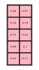
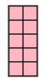

# Utility to draw matrices (two D array)

For documentation purposes.

## Usage

### Cli

Generate a random matrix of size 5, 2

```console
draw-matrix 5 2 --width=20 --height=20 --fontsize=5pt
```

The output can be piped in dot by using --embed=1


```console
draw-matrix 5 2 --embed=1 --width=20 --height=20 --fontsize=5pt | dot -Tsvg
```

Output:



Generate an empty matrix:

```
draw-matrix 5 2 --embed=1 --width=20 --height=20 --fontsize=5pt --random=0 | dot -Tsvg
```

Output:



## Installation

```console
pip install git+https://github.com/sondalex/draw-matrix.git
```

